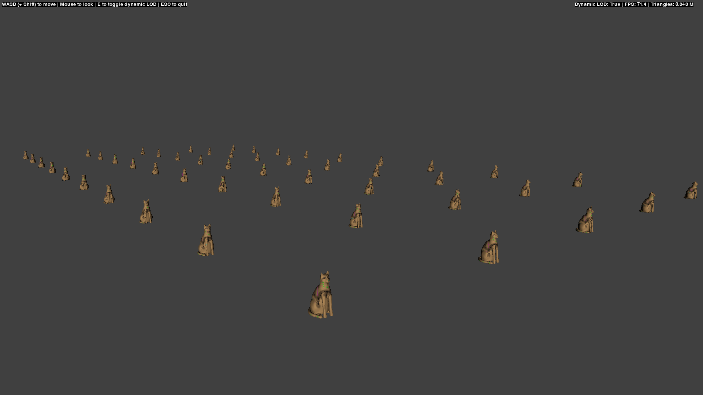
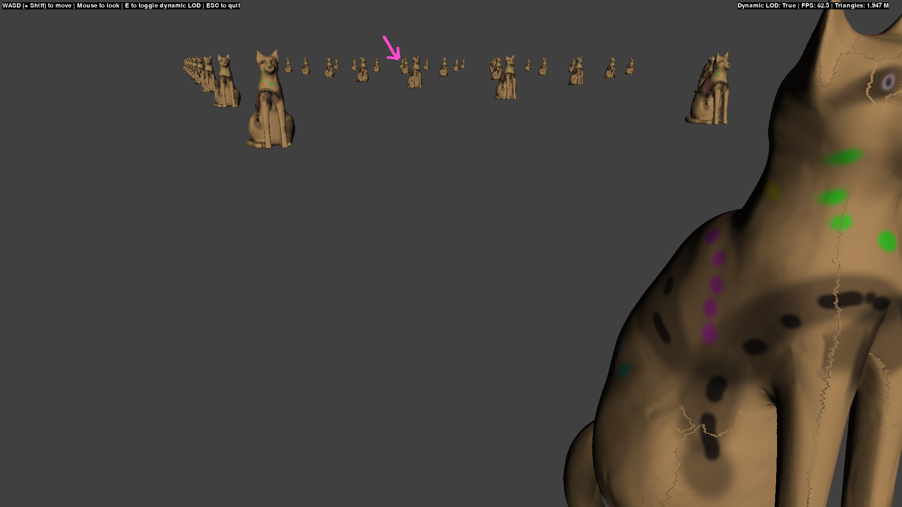
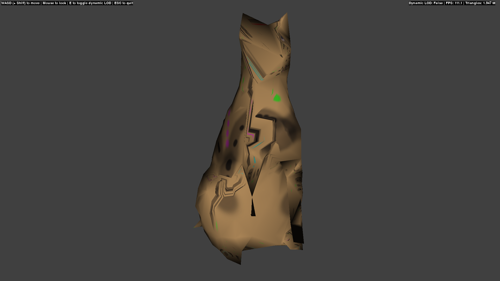

# pynanite

Simplified implementation of automatic level of detail for meshes (wannabe Nanite) in Python.

## Demo


Each of these cats is made up of 500k tris (25M+ total). Algorithm simplifies these to 0.85M rendered in this view.


The texture seams are very visible up close. Interpolation of texture coords is done based on two nearest neighbors. Switching to 3+ did not improve this. The arrow marks the furthest away cat (see below).


Turning off the dynamic LOD (press E) and then moving to the marked cat (arrow prev image): Low detail mesh. Texturing is now very messy.

### Performance

On my machine™

- Baking cat model (512986 tris) -> 17 LODs with 7442 clusters in total: 36s
- Startup: Loading baked model (0.4s) + placing 50 cats (2.3s)
- Viewing: No LOD updates: 110+ FPS
- Viewing: With LOD updates, static camera: 60+ FPS (due to annoying, non-visible LOD flickering)
- Viewing: With LOD updates & camera movement: 10-50 FPS


## Requirements

- Python 3.12: But it should work with older versions.
- numpy
- pygame: Displaying OpenGL, input handling.
- pyopengl: Rendering meshes.
- pillow: Loading textures.

Exclusively used during baking:
- pymetis: Graph partitioning at the heart of the algorithm.
- pyfmqr: Mesh simplification.
- scipy: Only used for spatial.KDTree (texture interpolation and geometric error calc)


## Features

The main source was the following video: [https://www.youtube.com/watch?v=eviSykqSUUw](https://www.youtube.com/watch?v=eviSykqSUUw)

I didn't check any other implementation, so this version might be odd?


### What is implemented

- Graph partitioning-based mesh LODs.
- Textures (badly done, still have nasty seams) and normals.
- Flying camera and frustum culling.
- LOD switching based on camera distance and mesh error (RMS).
- Everything is single-threaded.
- A beautiful cat model that has seen some things (thx Lexx).


### What is missing

This proof of concept is very far from the UE5 implementation:

- No GPU acceleration, no fancy memory management
- No materials, global lighting, etc
- The baked meshes (pickle files) are huge
- Super simple error metric. This kind of bugs me. I have to use hysteresis and still get occasional flickering. Even though I ensured that both error and bounding sphere radii are monotonic... This is specially visible close up.
- Only very basic culling
- Only static meshes, all verts are positioned and fixed at scene initialization

BTW this is not a TODO list, just mentioning some of the missing features.


## Setup / Usage

Note:
    This setup is works for Ubuntu 24.04.1

```sh
# Clone the repo
git clone https://github.com/oOo0oOo/pynanite.git
cd pynanite

# Setup venv & install dependencies
python3 -m venv venv
source venv/bin/activate
pip install -r requirements.txt

# Run the demo
python demo.py
```

### Controls

- WASD: Fly around
- Shift: Fly faster
- E: Toggle LOD updates
- ESC: Quit

## License

MIT